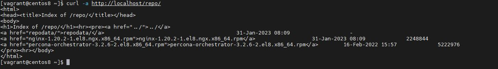

# Домашнее задание "Размещаем свой RPM в своем репозитории"

## Описание/Пошаговая инструкция выполнения домашнего задания:

1. Создать свой RPM пакет (можно взять свое приложение, либо собрать, например,
апач с определенными опциями)

2. Создать свой репозиторий и разместить там ранее собранный RPM

Реализовать это все либо в Vagrant, либо развернуть у себя через NGINX и дать ссылку
на репозиторий.

## Проверка 

